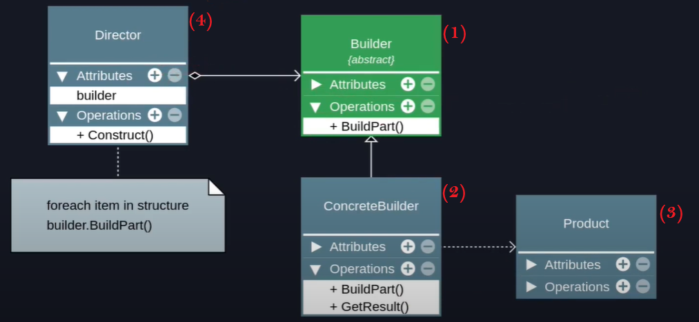

# <b style="color: white ; text-shadow: black 0.1em 0.1em 0.2em" >BUILDER</b>

## <b style="color: red">Intenção</b>
<p>Separar a construção de um objeto complexo da sua representação de modo que o mesmo processo de construção possa criar diferentes representações.</p>

## <b style="color: red">Visão geral</b>

* O padrão sugere a superação deo código que usa o objeto
* Trata da criação de objetos complexos (complexos de verdade)
    * Construtores muito complexos
    * Composição de vários objetos (composite)
    * Algoritmo de criação de objeto complexo
* Permite a criação de um objeto em etapas
* Permite method chaining
* O objeto final pode variar de acordo com a necessidade
* É um padrão complexo (quanto mais complexo o objeto, mais complexo o builder)

## <b style="color: red">Estrutura</b>

* Define a interface de todos os objetos "Builder". As estapas de construção em comum são definidas. (1 - contrato)
* Builders concretos implementam a interface de acordo com a sua necessidade. Elas podem produzir produtos de tipos diferentes. (2)
* Os produtos finais são os objetos que o cliente deseja consumir. Eles não tem interface em comum porque podem ser de tipos diferentes. (3)
* A classe "Director" é opcional. Ela pode definir a ordem em que as etapas de construção dos objetos são executadas (4)

[comment]: <  >

<p width= 30%; align="center">
  
</p>

## <b style="color: red">Exemplo</b>

//esse exemplo não é tão bom
```typescript
export class Person {
    constructor(public name?: string, public age?: number){}
}
```
```typescript
export class PersonBuilder {
    private person = new Person();

    newPerson(): void {
        this.person = new Person();
    }

    setName(name: String): this{
        this.person.name = nome;
        return this;
    }

    setAge(age: number): this {
        this.person.age = age;
        return this;
    }

    getResult(): Person{
        return this.Person;
    }
}

const personBuilder = new PersonBuilder();
const person1 = personBuilder.setName('Luiz').setAge(30).getResult();
personBuilder = newPerson;
const perso2 = personBuilder.setName('Maria').setAge(50).getResult();

```

## <b style="color: red">Consequências</b>

Bom                                      |Ruim
:----------                              | :----------------
Separa crianção de utilização | O código final pode se tornar muito complexo
O cliente não precisa criar objetos diretamente |
O mesmo código pode construir objetos diferentes |
Ajuda na aplicação dos princípios SRP e OCP |