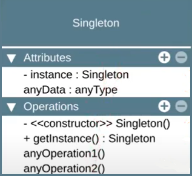

# <b style="color: white ; text-shadow: black 0.1em 0.1em 0.2em" >SINGLETON</b>

## <b style="color: red">Intenção</b>
<p>Garantir que uma classe tenha <b>somente uma instância</b> no programa e fornecer um <b>ponto de acesso global</b> para a mesma.</p>

### <i>somente uma instancia?</i>
* <p>Geralmente usado para acesso a <i>recursos compartilhados</i> com acesso à base de dados, interfaces gráficas, sistemas de arquivos, servidores de impressão e mais.</p>
* <p>Também usado para substituir variáveis globais, como em casos de uso de <i>objetos de configuração do sistema</i> como um todo.</p>

### <i>Ponto de acesso global?</i>
* <p>Você pode permitir o acesso global ao singleton em toda a sua aplicação, assim como faziamos (ou fazemos) com variáveis globais.</p>
* <p>Uma vantagem do singleton é que podemos proteger a instância com encapsulamento, evitando que outro código sobrescreva seu valor.</p>

## <b style="color: red">Estrutura</b>

* Atributo privado para a instância
* Qualquer dado necessário para o singleton
* Construtor privado não permite o uso de new com o Singleton. Também não há parâmetros aqui.
* Getter para instance - aqui decidimos se criamos uma nova instância ou retornamos a instância já criada
* Quaisquer métodos necessários para o Singleton

[comment]: <   >

<p width= 30%; align="center">
  
</p>

## <b style="color: red">Implementação</b>

```typescript
export class Singleton{
    private static _instance: Singleton | null = null;

    private constructor(){
        //new not allowed outside the class
    }

    static get instance(): Singleton {
        if (Singleton._instance === null){
            Singleton._instance = new Singleton();
        }

        return Singleton._instance;
    }
}

const instance1 = Singleton.instance;
const instance2 = Singleton.instance;

console.log(instance1 === instance2); //true
```

## <b style="color: red">Aplicabilidade</b>

* Use o singleton quando uma classe precisa ter somente uma instância disponivel em todo o seu programa
* use o singleton quando perceber que está usando variáveis globais para manter partes importantes do programa, como variáveis de configuração que são usadas por toda a aplicação

## <b style="color: red">Consequências</b>

Bom                                      |Ruim
:--------------------------------                              | :----------------
Acesso controlado a instância única                    |É mais dificil de testar
É fácil permitir um número maior de instâncias caso mude de ideia |Viola o princípio da responsabilidade única
Usa <i>lazy instation</i>, o Singleton só é criado no momento do uso     | Requer tratamento especial em casos de concorrência
Substitui variáveis globais       | Erich Gamma (autor) descreveu que esse seria o único padrão que ele removeria se fosse refatorar o livro
